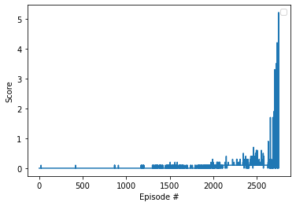

## Introduction

This project is a DDPG (Deep deterministic policy gradient) implementation to solve a multi agent collaboration and competition
environment, consisting in two players playing Tennis and trying to keep the ball in the air as long as possible. The 
implementation is based on the bipedal implementation provided by Udacity [here](https://github.com/udacity/deep-reinforcement-learning/tree/master/ddpg-bipedal).

A DDPG single agent was chosen to solve this multi agent problem. The agent take both states as input and outputs the
actions of the both players.

## About the algorithm

DDPG is an off-policy algorithm focused on solving environments with continuous spaces. In fact, it's called a "Q learning
algorithm for continuous spaces". It works good with multiple agents in parallel.

As an improvement of the Actor-Critic algorithm, DDPG consists on two networks: the critic and the actor.

### Critic

The critic is updated by a value-based method, so the objective is to minimize the loss of the function. It will be computed
first in the learn method. This network will receive the state and the actions chosen by the actor, and return an evaluation
number for each action. This evaluation number will be used later to compute the loss of the actor.

### Actor

The actor is updated by a policy-based method, and it's deterministic; only the best (continuous) action is returned. As
a policy-based network, the objective here is to maximize the function. To update this network we will need the critic to
evaluate its actions, so we can compute the loss.

In this method we will use Experience replay and target networks for each network, which will be soft-updated on each network update.

This algorithm is well explained by OpenAI [here](https://spinningup.openai.com/en/latest/algorithms/ddpg.html).

## Network architecture

The DDPG algorithm uses two networks, and actor and a critic. The architecture of these networks are:

Actor:

- 1 fully connected layer with 48 inputs and 128 outputs (fc1)
- 1 fully connected layer with 128 inputs and 128 outputs (fc2)
- 1 fully connected layer with 128 inputs and 4 outputs (fc3)
- 2 ReLU functions, to apply to fc1 and fc2 in the feed forward
- 1 batch normalization function, to reduce variance applying it to fc1
- 1 Tanh function, to apply to the final layer fc3

Critic:

- 1 fully connected layer with 48 inputs and 128 outputs (fc1)
- 1 fully connected layer with 132 inputs (128 + action size) and 128 outputs (fc2)
- 1 fully connected layer with 128 inputs and 1 output (fc3)
- 2 ReLU functions, to apply to fc1 and fc2 in the feed forward
- 1 batch normalization function, to reduce variance applying it to fc1

## Hyperparameters

The hyperparameters used in this implementation were:

- Buffer size: 10000
- Batch size: 128
- Gamma: 0.99
- TAU: 0.001
- Learning rate (actor): 0.0002
- Learning rate (critic): 0.0002
- Weight decay: 0 

## Observations

The agent was able to solve this multi-agent environment in 2754 episodes (around 30 minutes), what demonstrates the power
of this off-policy algorithm, being capable of solving single and multi agent problems.

The learning process was like a wall: 2600 episodes aprox didn't seem to learn consistently (0.1 rewards, sometimes getting
0.4 at max). Then, in aprox 100 episodes the agent was able to consistently get between +3 and +5 rewards in most episodes,
reaching the target average reward of 0.5 rapidly.

Thoughts: I think this approximation learns slowly because a single agent receives a lot of parameters as input (the states
of all agents in the environment), but plays better because all agents act as a single brain.

Here we can see how the agent learnt in a graphical mode:

## Next steps

- I want to implement a separated agents strategy, to see which strategy works better
- I want to solve the Soccer environment and see which challenges approach me